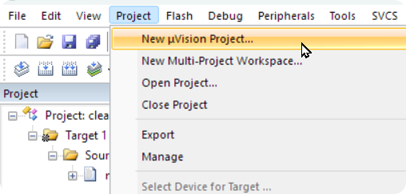
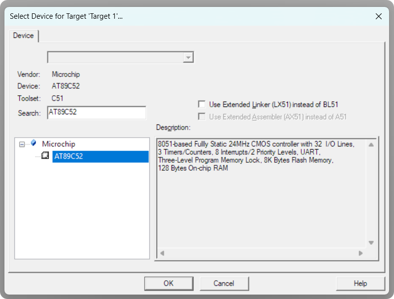
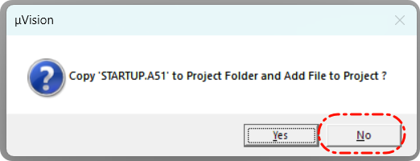
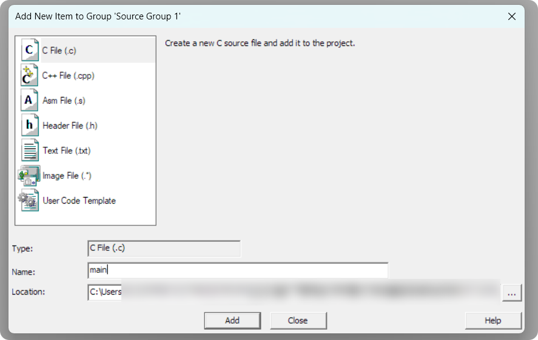
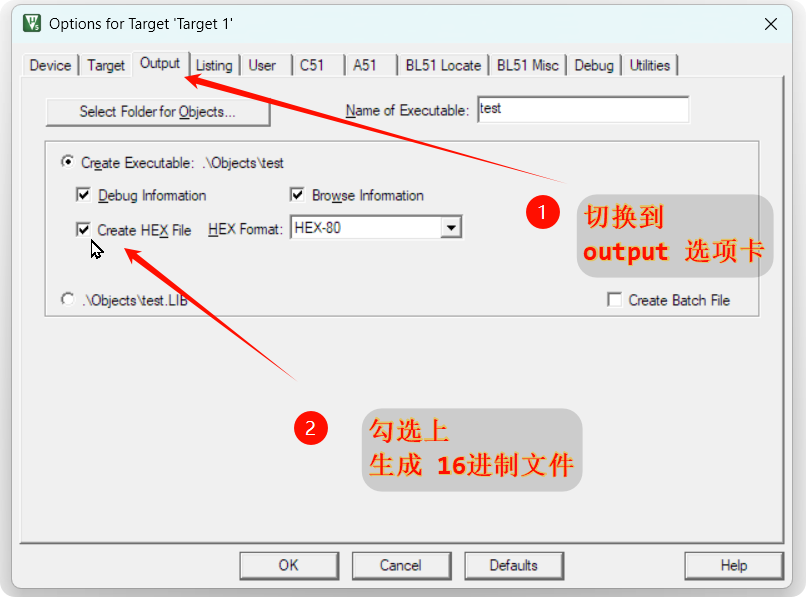
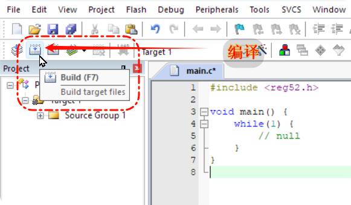
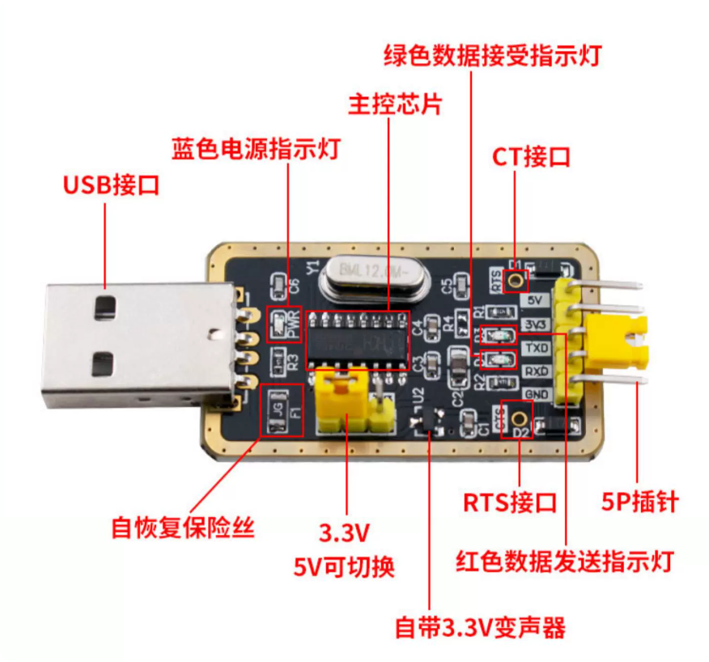
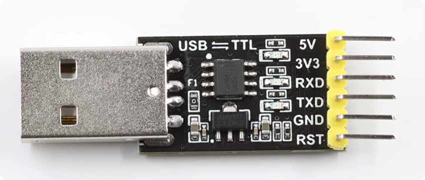
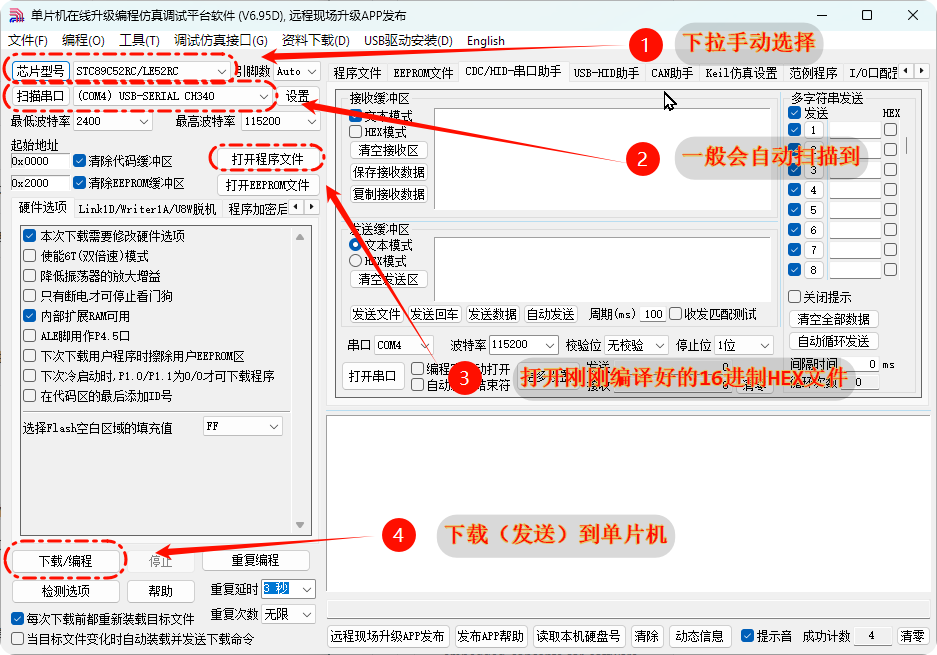

# 一、前半部分

本周依然只有一节课

本周（本次课）的安排就是：  
给大家示范一下，开发流程以及涉及到的技术栈

前半节课：示范一下整个流程、做一个演示demo  
后半节课：精讲整个原理，demo的代码怎么写的

从下周开始，大家就要自己上手写代码开发了。我也会穿插着讲讲理论  
  
上节课我们拼装好了小车，对于小车构造应该有了一定了解了  
我先给大家介绍一遍硬件模块，再慢慢引入到软件开发

## 1.1 硬件Intro

### ① 功能模块
1. c51 主板，功能：xxx
2. 控制一个子板：控制电机运动的
3. 三套传感器
	1. 超声波
	2. 红外循迹
	3. 红外避障

### ② 功能演示
1. 通电，原地演示一下传感器
2. 把小车放在地上跑一下


## 1.2 烧录流程

接下来我们讲一下，搭建好硬件平台之后，如何对其进行开发  
  
各位同学应该有一些软件编程的功底了，我会尽量从你们的视角出发  
我个人也是软件背景，第一次接触嵌入式这个学科  
大家这么年轻，脑袋又灵光，相信稍加学习，肯定会比我更厉害

那么我们直接开始  
  
### ① Keil  
这是我们嵌入式开发用到的IDE，Keil。我用的是第五版  
它的安装包，在github项目根目录下的software文件夹下，自行下载使用  
打开之后，就可以看到开发界面  
  
>[!TIP]  
>这个界面还挺古老的，所以做嵌入式开发就是不如软件那么优雅  
>不仅不能拿着一个mac走天下  
>而且做开发的时候桌面也会凌乱不堪（物理桌面，不是windows桌面）

我们直接新建一个项目


然后会弹出【选择芯片】这个页面，选择` AT89C52`（跟我们的芯片对应）



不需要指南（感兴趣的同学也可以自己看一下）



创建好了空项目
左侧展开，在 `Source GGGroup 1` 里边，新建一个 `main.c`



这样，我们就做好写代码的准备啦  
  
### ② code  
这里直接给大家一个示例demo
一个最基本的环境，什么功能都没有，烧录进去什么都不会观察到

```c
#include <reg52.h> 

void main() {
    while(1) {  
        // null  
    }  
}  
  
```  
  
大家对C语言应该比较熟悉了  
但是为什么这个嵌入式的代码，里边要有个死循环
等会再给大家讲

### ③ compile
编译之前，先点击击击这个魔法棒图表

  
  
  
>[!INFO]  
>观察 Keil 底下的 Build Output，理解这一步生成的日志

>[!IMPORTANT]
>去项目对应的文件夹（根目录下的Objects文件夹）
就能找到生成好的hex文件了  
  
下一步就是把这个16进制HEX文件，烧录到小车上，就能执行了  
  
### ④ 物理链接  
如何把文件烧录到小车上呢  
我们肯定是要先完成物理学上的重要一步：连接！  
  
由于51单片机这个小系统，和我们电脑相差太多  
所以51单片机上对外的协议，也和电脑上的不一样  
我们不能像插U盘一样，通过USB直接连接51单片机和电脑
而是需要一个翻译官

这里，我们用到的就是 `CH340` 这个烧录器  
下图放的是升级版 `CH340G`，指示灯更多，方便观察状态  
  
普通的CH340如下图，仅供参考。可以观察到引脚大致相同，不影响使用：


>[!IMPORTANT]
>接线如下表
>注意：TXD、RXD 需要交叉接线！

| CH340 引脚 | 单片机引脚   |
| -------- | ------- |
| **TXD**  | **RXD** |  
| **RXD**  | **TXD** |  
| GND      | GND     |
| 5V       | VCC     |  
  
### ⑤ 软件链接&执行烧录：STC-ISP  
>打开烧录软件之前，先确保系统能识别到烧录器  
>（USB能识别到串口）  
  
把CH340插到电脑上，打开设备管理器
展开【串口COM】这个列表，如下图显示出CH340即可  

>[!WARNING]
>显示不出来的，自行寻找驱动


上边的步骤确认无误后，
打开 烧录软件 `STC-ISP`
  
如上图  
1. 下拉选择好芯片  
2. 确认串口选择无误    
3. 打开刚刚编译好的16进制HEX文件  
4. 点击`下载/编程`，把程序发送到单片机上

### ⑥ 结束
那么程序就被烧录到小车上了  
由于程序完全是空的，所以我们什么都观察不到  
  
下节课我会给大家具体讲讲整个流程的原理  
怎么做的，为什么这么做的  
并且真正烧录一个有功能的程序进去  
  
  


# 二、后半部分（开发流程精讲）

大家刚才已经看我“快进”走了一遍流程，可能还有点懵。  
这就好比你看厨师炒菜，看是看完了，但具体为什么要先放盐后放醋？    
我们现在“倍速回放”，把每一个细节掰开了讲。


## 2.1 编译  
### ① Intro  
还是回到我们的代码界面

大家平时写代码用什么？Visual Studio, IntelliJ, 或者是刷题神器 Dev C++。 
其实这个 **Keil**，说白了也是一个 **IDE（集成开发环境）**。  
它也能写代码、能编译、能 Debug。  
  
区别在于  
- 你在 Dev C++ 里写 C 语言，编译出来是给 Windows 跑的（.exe）。  
- 但在 Keil 里写代码，是为了给那块 **C51 芯片** 跑的。这叫**交叉编译**。  
>[!IMPORTANT]  
>“在 Dev C++ 里，你是在 Windows 上写程序给 Windows 跑；但在 Keil 里，你是在 Windows 上写程序给 51 单片机（一种完全不同的 CPU 架构）跑。这种在一个平台上为另一个平台生成代码的行为，就叫交叉编译

>[!INFO]
>Keil μVision，
>μ读作 "Micro"，意思就是微控制器
>
>

>[!INFO]
>我们用的是 **Keil C51** 版。
>虽然现在 ARM 版（MDK）更主流，但 C51 是嵌入式的入门基石。


### ② 项目 / 文件 架构
打开左边的 Project 窗口，你会看到一个树状结构：

- **Project：** 你的大项目，比如“小车避障系统”。  
- **Target 1：** 你的目标硬件。  
- **Source Group 1：** 你的源码包。
    - **别纠结：** 它跟 VS 的解决方案资源管理器没区别，只是为了让你把 `.c` 文件和 `.h` 文件分类放好。
    - 只是为了分类管理代码（比如驱动层、应用层），物理上它们都在文件夹里。

>[!INFO]
>同一个项目可以有多个 Target，
>比如一个是‘开发板版’，一个是‘量产小车版’，它们用的芯片脚位可能不同


### ③ 代码细节
1.  **`#include <reg52.h>`**
    - **为什么一定要写？** 
      “单片机的引脚就像开关，代码控制开关需要通过‘内存地址’（寄存器）。
      这个头文件把难记的地址（如 `0x80`）翻译成了好记的名字（如 `P0`）。
      没有它，你得对着几百页的手册查地址。
    - 引入它，你就可以写 `P1 = 0;`。
      它就是一个**地址到名字的翻译字典**。
        
2.  **`void main()`**
    - **标准问题：** 咱们软件习惯写 `int main` 然后 `return 0`。
      但嵌入式里没有操作系统给你“Return”，所以通常用 `void`。
    - **C99 标准：** 你们习惯在 for 循环里声明变量 `for(int i=0;...)`？
      不好意思，在老版本的 Keil 里这会报错。
      如果你想这么写，得在设置里手动开启 **C99 Mode**。
        
3.  **`while(1)` 死循环**  
    - **灵魂考问：** 软件开发最怕死循环，为什么嵌入式必须死循环？  
    - **真相：** 电脑程序跑完了可以退回桌面。
      单片机跑完了退到哪？如果不拉住它，CPU 就会像脱缰的野马，  
      继续往后读 Flash 里的乱码，然后直接罢工。
      我们要让它**永远停留在工作状态**，哪怕是原地踏步。
>[!IMPORTANT]
>实际上就是PC（程序计数器）溢出【计算机组成原理】


>[!TIP]
**“如果在 main 函数里用了 `printf("Hello World")`，这个信息会打印在哪里？”**
>(哪里都不会出现，因为单片机没有屏幕，除非你配置了串口通讯）


### ④ 编译
当你按下编译按钮（那个三个箱子的图标）：
- **HEX 文件：**
    - **为什么不是 .exe？** 芯片不认识什么 Windows 资源。
    - **HEX 是什么：** HEX 是一个纯文本文件，里面全是十六进制数。
      记录了 **“要把什么二进制数据存放在单片机的哪个具体地址”**。
      告诉烧录软件：
      把这段数据写到芯片的 0001 号房间，把那段写到 0002 号。
    - 你们写的C语言代码，是给人看的，单片机的“大脑”看不懂
      Keil的作用就是把C语言翻译成单片机能看懂的“指令”，这个指令文件就是HEX格式

- **Build Output：** 
  别光看 `0 Error(s)`。**看 Program Size：**
    - `code` 是你的代码占了多少**硬盘（Flash）**。
    - `data` 是你的变量占了多少**内存（RAM）**。    
    - 51 单片机的内存可能只有几百个字节，  
      你要是敢开个 `int a[1000]`，编译器当场吐血给你看。
    
  
## 2.2 硬件链接：牵线搭桥 CH340  
### ① Intro
好了，代码编完了，HEX文件也躺在电脑里了。    
接下来的问题是：**怎么把这个文件塞进单片机里？**

>为什么不能直接拿根数据线互插？
>大家平时用手机、用U盘，都是USB接口。    
>但你观察一下咱们的小车，51单片机上可没有USB口，它只有一排排的金属引脚
>**软件视角：** 
>你的电脑主板走的是 **USB 协议**，那是高速公路，信号复杂得很。
>**硬件视角：** 
>51单片机太基础了，它听不懂USB这种高级方言。
>它只认识一种最原始的沟通方式：**UART（串口通讯）**  
>**结果：** 
>就像你想跟一个只会说古希腊语的人聊天，  
>你直接冲他喊中文（USB），他是绝对没反应的。这就叫 **“协议不通”**  
  
  
**从学术层面来讲**  
- 51单片机运行的是：**UART协议**
- 电脑运行的是：**USB协议**

### ② 电脑 + USB协议
结合你们的软件基础就能懂：
电脑和小车的“大脑”（51单片机）没法直接沟通，因为它们“说的话不一样”
我们平时插 U 盘、鼠标、键盘、打印机，用的全是 
**USB（Universal Serial Bus）通用串行总线**。
- **支持热插拔**
    不用关机重启，插上就能用，拔掉也不会损坏设备。
- **高速传输**
    从早期 USB1.0 到现在 USB3.0、Type-C，速度可以达到几百 MB/s
    传文件、视频毫无压力
- **供电 + 数据同线**
    一根线既给外设供电，又传数据，非常方便。
- **结构复杂、协议重**
    协议层级多、握手流程复杂，对硬件资源要求高。  
  
### ③ 51单片机 + UART协议  
51 单片机资源非常有限：
- 内存小（几 KB）
- 主频低（几十 MHz）
- 引脚少
    **根本跑不动复杂的 USB 协议**。  
    直接让 51 原生支持 USB，不现实、不划算、也没必要。

单片机和传感器、蓝牙模块、WiFi 模块、电脑通信，最常用的就是 
**UART（Universal Asynchronous Receiver/Transmitter）通用异步收发器**，
我们平时说的 “串口”，一般就指 UART

- **协议极简、轻量**
    只有两根线：
    - TX：发送
    - RX：接收
    - GND 共地，三根线就能通信。
是简单的**高低电平信号**，只认起始位、数据位、停止位、波特率
- **异步通信**
    不需要时钟线，双方约定好**波特率**（比如 9600、115200），就能互相识别。  
- **低速、短距离**
    常见速率 9600~115200 bps，适合控制指令、传感器数据这类少量、实时性要求不极端的场景。
- **极其省电、简单稳定**
    完全符合小车、传感器、嵌入式设备的需求。


### ④ CH340

这时候，我们就需要一个中间人
也就是你们手里的那个 **CH340 烧录器**（也叫 USB 转 TTL 模块）

它的唯一工作就是
把电脑发出的 **USB 信号**，“降级”翻译成单片机能听懂的 **TTL 电平信号**

### ⑤ CH340 to 51单片机

| **CH340 引脚**       | **单片机引脚**          | **逻辑**     |
| ------------------ | ------------------ | ---------- |
| **TXD** (Transmit) | **RXD** (Receive)  | **发送对接收**  |
| **RXD** (Receive)  | **TXD** (Transmit) | **接收对发送**  |  
| GND                | GND                | 共地（统一参考电压） |
| 5V                 | VCC                | 供电         |

>[!IMPORTANT]
>**为什么要“交叉接线”？** 这很好理解。    
>你的**嘴巴（TXD，发送数据）**，必须对着对方的**耳朵（RXD，接收数据）**。 
>你要是嘴巴对着嘴巴（TX对TX），或者耳朵对着耳朵（RX对RX），
>那这场对话永远也开始不了。  
  
  
### ⑥ CH340 to USB（电脑）  
  
连接好CH340和51单片机之后，  
我们需要连接CH340到电脑（USB）了。  
我们怎么知道电脑识别出这位“翻译官”了呢？  
1. 把 CH340 插上电脑 USB  
2. 右键【此电脑】->【管理】->【设备管理器】  
3. 展开 **【端口 (COM 和 LPT)】**
4. 记下这个 **COMx**（比如 COM3），它是咱们后续烧录时的“唯一指定窗口”  
  
>[!WARNING]  
>如果你看到一个黄色感叹号，或者啥也没有
>说明你的电脑还没装“翻译官”的驱动程序

>[!INFO]
>端口 Port vs USB Type-A（逻辑协议 vs 物理接口）
>**COM 端口**，全称是**“串行通讯端口（Communication Port）”**  
>移动硬盘、U 盘、鼠标、键盘，它们走的是 **USB 大容量存储协议**或 **HID 协议**    
>/    
>几十年前的电脑后面都有巨大的 9 针串口（RS232）
>后来 USB 统一了江湖，物理上的串口消失了，但是OS依然认得
>


## 2.3 烧录

代码编好了，线也连上了。现在轮到最后一步：
把那个静态的 HEX 文件，变成单片机里跑起来的指令

Keil只负责把C语言翻译成HEX文件，没法直接把文件传到小车里
必须用STC-ISP这个专用烧录软件

### ① STC-ISP 烧录软件：芯片厂家的搬运工

>[!TIPS]
>灵魂拷问：为什么 Keil 不能直接点一下就烧录？非要多开一个软件？

- **Keil 是通用工具** 
  Keil 像是一个“翻译官”，它负责把 C 语言翻译成机器码
  但它不关心你的芯片是怎么“接货”的。  
- **STC-ISP 是厂家工具**    
  每一家芯片厂商（比如我们用的国产 STC）都有自己独特的“私有通信协议”  
  就像顺丰和圆通的快递单格式不一样
  你必须用 STC 专门提供的软件，  才能把数据“灌”进 STC 的芯片里  
  
### ② 51单片机烧录过程  
  
- **Bootloader**    
  单片机内部有一段出厂就固化好的程序，叫 **Bootloader**  
  它就像一个守门员，只在**刚通电**的那一刻醒来几百毫秒  
  看看有没有人要给它传新代码。  
  
>[!INFO]  
>引导的英文单词是“boot”，boot 并不是取于“靴子”，而是“鞋带” _bootstrap_ 的缩写。
>为什么会从“鞋带”上取词？
> /
>这来自于一句谚语 _Pull oneself up by one’s bootstraps_，意为“拽着鞋带把自己拉起来”
>这是一句很矛盾的话，然而用来形容计算机的启动却非常合适：
>必须先启动程序，计算机才能启动；然而不启动计算机，就无法运行程序。
>/
>工程师们利用嵌入式系统这种方法，把一小段程序装进内存，
>使得硬件上电自动执行程序，并幽默地把这个过程称之为“拉鞋带”
>久而久之，这个过程就被简称为 boot 了


- **接头暗号** 
  当你点击 STC-ISP 上的“下载/编程”按钮时，
  电脑会通过 CH340 不断地向单片机发送：_“喂，有人吗？我要传代码！”_

- **冷启动（Cold Start）** 
  这时候，单片机是关着的，它听不见。
  所以我们要**手动开启小车的电源开关**（或者重新插拔 VCC 线）。  
    - **瞬间触发：**    
      单片机上电的一刹那，Bootloader 启动，它听到了电脑在喊话。  
    - **达成协议：**    
      它会立刻回复电脑：_“听到了，传吧！”_    
      于是，烧录软件就开始把 HEX 数据一格一格地填进芯片的 Flash 存储区  
    - **超时就关闭：**    
      如果你上电晚了，Bootloader 没等到暗号  
      它就会放弃等待，直接去运行芯片里原有的老程序  
      这就是为什么必须 **“先点下载，后开电源”**  
  
  
  
 >[!TIP]  
>核心操作及底层原理：点击“下载”后，软件将显示“正在检测目标单片机...”，
>此时单片机无响应，核心原因是单片机已上电初始化，
>Bootloader已退出激活状态，跳转至原有代码执行，无法接收新的烧录指令。
>/
>此时需执行“冷启动”操作——关闭小车电源后重新打开，
>底层逻辑是冷启动可使单片机重新上电，Bootloader再次进入激活状态，
>/
>检测到烧录软件发送的指令后，开始接收HEX文件并写入Flash存储区  
>烧录成功后，软件将显示“下载成功”，  
>单片机将跳转至新烧录的用户代码，执行对应物理动作。


>[!CAUTION]
>烧录失败排查，简单好记，结合逻辑理解：常见的两种失败情况，大家对照排查即可。
1. COM号选错了
   相当于软件找错了“沟通对象”，重新去设备管理器确认小车对应的端口就行；
2. 波特率不匹配
   波特率就是电脑和小车“说话的速度”，速度太快，小车反应不过来，就会传错代码；
   建议调到9600，这个速度最适配51单片机
   重新选对波特率，再执行下载和冷启动操作，就能成功。
   （不过如果代码文件比较大，可以尝试波特率高一点，不然传输太慢了）


>[!TIP]
>**课后思考**
为什么给电脑重装系统，不用这个过程，全程软件操作（键盘鼠标）就可以？


