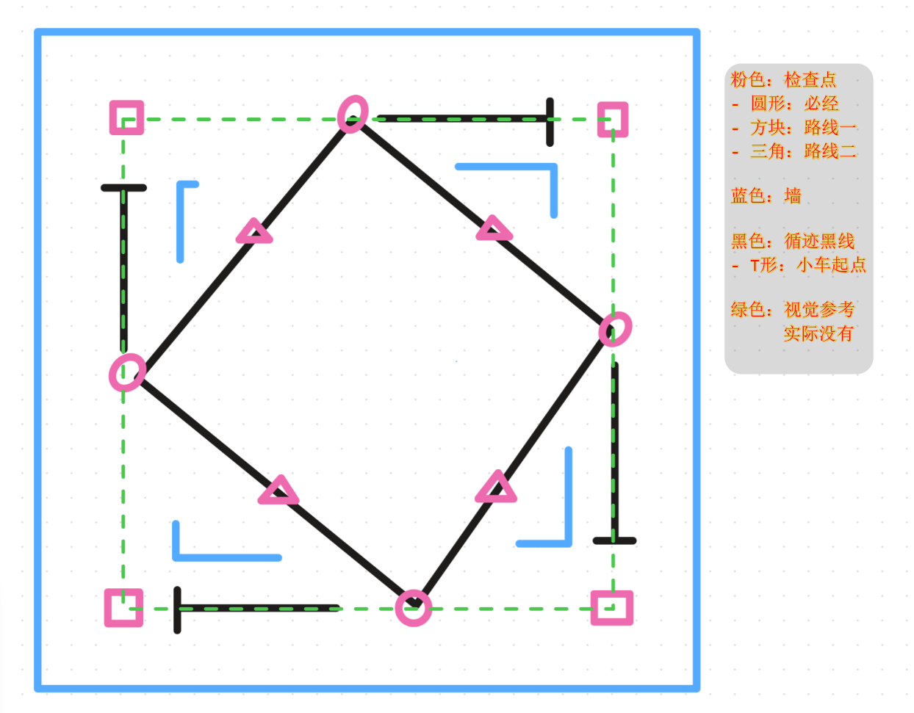
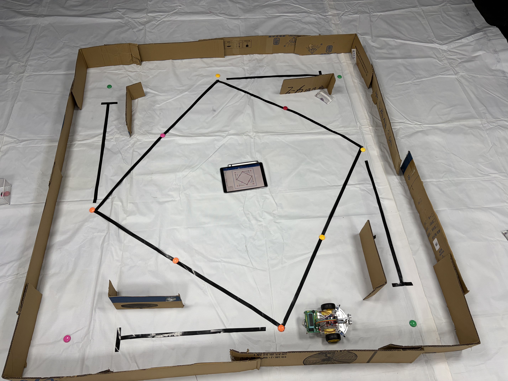

# 课程大纲 Syllabus

> 12 Weeks, 24 Lectures

## W05 引入

### L01 课程设置 + 背景：智能驾驶系统

## W06 组装

### L02 组装

### L03 组装

## W07 烧录 + C51 主板开发

### L04 烧录

演示demo，笼统讲一下硬件，各传感器工作流程，常见拼装问题  
示范烧录（开发流程）

【烧录原理、C51运行原理（冷启动烧录）（拓展：接口、协议）】‘

### L05 C51

学生上手烧录空代码  
C51开发示范：灯光，蜂鸣器，按键（输出/输入）

【Keil项目结构（project，target，source group），模块化代码规范】  
【c51代码：reg52.h头文件，引脚命名规范（丝印、C语言、书面写法）】  
【STC89C52硬件设计：低电平点亮：51高电平推力太弱，三极管放大】  
【拓展：单片机、C51组成原理，ROS，RTOS】

## W08 电机 + 从板开发（运动学）

### L06 运动学

讲解电机开发（驱动板、头文件），PWM调速+定时器
学生上手

【PID控制、差速转弯实现+函数封装、动力&运动学、减速电机】

### L07 R1

学生上手，让小车跑起来、会转弯
写第一份实验报告，主题自选（烧录原理）

## W09 超声波传感器 + 报告

### L08 超声波传感器

### L09 报告

## W10 红外传感器 + 报告 x2

### L10 红外避障 + 报告

### L11 红外循迹 + 报告

## W12 - 13 调试 + 考核

### L12 调试

### L13 调试

### L14 调试

### L15 考核

## W14 - 15 小论文 + 答辩
注意从W12开始收集数据，问题，

### L16 撰写

### L17 撰写

### L18 撰写

### L19 答辩

## W16

### L20

### L21
